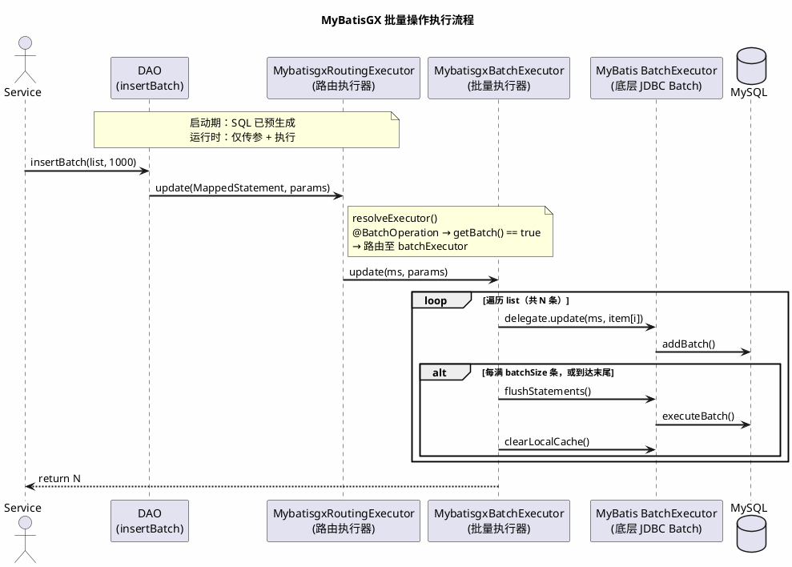

## 一、批量操作本该很简单

项目里批量操作场景太常见了：

- 导入 Excel 数据
- 同步第三方接口数据
- 定时任务批量落库
- 状态批量更新

但翻开不同框架的文档，你会发现：**这么基础的能力，复杂度差了好几档。**

---

## 二、各框架是怎么写批量的

先看代码，直接感受差距。

### 原生 MyBatis

原生 MyBatis 要用真正的 JDBC batch，需要手动打开 `ExecutorType.BATCH` 的 Session，自己管理生命周期：

```java
// Mapper 接口（单条插入）
void insert(User user);
```

```java
// 调用方：手动管理 BatchSession
SqlSession sqlSession = sqlSessionFactory.openSession(ExecutorType.BATCH, false);
try {
    UserMapper mapper = sqlSession.getMapper(UserMapper.class);
    for (int i = 0; i < users.size(); i++) {
        mapper.insert(users.get(i));
        if ((i + 1) % 1000 == 0 || (i + 1) == users.size()) {
            sqlSession.flushStatements();  // 手动 flush
        }
    }
    sqlSession.commit();
} catch (Exception e) {
    sqlSession.rollback();
    throw e;
} finally {
    sqlSession.close();
}
```

**每次批量操作都要写这一套模板代码，容易遗漏 flush，也容易忘关 Session。**

### MyBatis-Plus

批量操作在 `IService` 里，不在 Mapper 里。必须让 ServiceImpl 继承 `ServiceImpl<Mapper, Entity>`：

```java
@Service
public class UserServiceImpl extends ServiceImpl<UserMapper, User> implements UserService {

    public void importUsers(List<User> users) {
        this.saveBatch(users, 500);  // 只能通过 IService 的方法调
    }
}
```

**必须先有 Service 层、必须继承 ServiceImpl，DAO 层没有批量能力。**

### MyBatis-Flex

`BaseMapper` 有个 `insertBatch` 方法，但它是 MyBatis for 循环，不是真正的 JDBC batch 协议。

真正的批量写法要用 `Db.executeBatch`：

```java
Db.executeBatch(users, 1000, UserMapper.class, (mapper, user) -> mapper.insert(user));
```

能用，但 lambda + 类型 + 回调，写法比较重。

### MyBatisGX

```java
userDao.insertBatch(list);
userDao.updateBatchById(list);
userDao.deleteBatchById(ids);
```

**直接调 DAO，不需要继承任何东西，不需要任何工具类。**

---

对比一下：

| 框架 | 调用方式 | 额外负担 | SQL 生成时机 | 真 JDBC batch |
|---|---|---|---|---|
| 原生 MyBatis | 手动 BatchSession | 手动管理 Session 生命周期 | 手写 | 是 |
| MyBatis-Plus | `IService.saveBatch` | 必须继承 ServiceImpl | 运行时 | 是 |
| MyBatis-Flex | `Db.executeBatch` | lambda + 类型 + 回调 | 运行时 | 是 |
| **MyBatisGX** | `dao.insertBatch` | **无** | **启动期预生成** | **是** |

---

## 三、为什么坚持这种设计

### DAO 是唯一入口

批量操作本质上是数据访问层的能力。它不应该扩散到：

- Service 层（MyBatis-Plus 的路子）
- 全局静态 Db 工具（MyBatis-Flex 的路子）
- 手动管理的 BatchSession（原生 MyBatis）

**让它待在它该在的位置。**

### 语义要直白

```text
insertBatch     = 批量插入
updateBatchById = 按主键批量更新
deleteBatchById = 按主键批量删除
```

方法名就是含义，不需要查文档。

### 分批大小可控

默认 `batchSize=1000`，可以自己传：

```java
userDao.insertBatch(list, 500);   // 每 500 条提交一次
```

不用担心数据量大了撑爆内存。

---

## 四、性能不打折

**先说结论：**

> **批量插入：MyBatisGX ≈ 原生 MyBatis，比 Flex 快约 14%，比 Plus 快约 25%。**
> **批量更新：MyBatisGX 与 Flex 差距约 5%，均优于 Plus。**

测试环境：JVM `-Xms1g -Xmx4g`，单条记录约 10 个字段，每框架跑 15 次，去掉第 1 次冷启动取稳定区间。

### 批量插入 100 条

| 框架 | 稳定区间 | 均值 |
|---|---|---|
| MyBatisGX | 7ms ~ 17ms | ~10ms |
| 原生 MyBatis | 6ms ~ 19ms | ~10ms |
| MyBatis-Flex | 10ms ~ 32ms | ~19ms |
| MyBatis-Plus | 10ms ~ 30ms | ~18ms |

### 批量插入 1W 条

| 框架 | 稳定区间 | 均值 |
|---|---|---|
| MyBatisGX | 264ms ~ 409ms | ~320ms |
| 原生 MyBatis | 239ms ~ 459ms | ~290ms |
| MyBatis-Flex | 293ms ~ 580ms | ~370ms |
| MyBatis-Plus | 350ms ~ 686ms | ~430ms |

> **1W 条批量插入，MyBatisGX 比 MyBatis-Plus 快约 25%，比 MyBatis-Flex 快约 14%。**

### 批量更新 100 条

| 框架 | 稳定区间 | 均值 |
|---|---|---|
| 原生 MyBatis | 12ms ~ 25ms | ~16ms |
| MyBatisGX | 16ms ~ 28ms | ~20ms |
| MyBatis-Flex | 18ms ~ 29ms | ~23ms |
| MyBatis-Plus | 19ms ~ 31ms | ~25ms |

### 批量更新 1W 条

| 框架 | 稳定区间 | 均值 |
|---|---|---|
| 原生 MyBatis | 1294ms ~ 1618ms | ~1450ms |
| MyBatis-Flex | 1397ms ~ 1674ms | ~1560ms |
| MyBatisGX | 1423ms ~ 1855ms | ~1640ms |
| MyBatis-Plus | 1497ms ~ 1965ms | ~1720ms |

> **批量更新 1W 条，MyBatisGX 与 Flex 差距约 80ms（约 5%），原生 MyBatis 最快。**

### 为什么批量插入能做到这个性能？

MyBatisGX 的批量操作本质上仍然是：

- JDBC batch 协议（`addBatch` + `executeBatch`）
- MyBatis BatchExecutor 执行
- **SQL 在启动期预生成，运行时不再拼接**
- 无 persistence context 干预
- 无反射取字段，无 Lambda 包装

运行时只剩"传参 + 执行"两步，这是批量插入性能贴近原生的根本原因。

---

## 五、执行流程



---

## 六、写在最后

批量操作本来就不应该复杂。

它只是数据库最基础的写入方式，却被各框架包装成了"必须先学一套约定"才能调的能力。

MyBatisGX 想做的事情很朴素：

> **把一个本来应该简单的能力，还原成简单的样子。**

调用最短，语义最直，性能不打折。

从命名到约束,从定义到归属,这些追求背后有一个更简单的信念:

**Coding 是一种艺术。**

好的代码有结构、有表达、有边界。持久层尤其如此——它离数据最近,也最容易成为系统混乱的根源。MyBatisGX 的每一个设计决策,都是在试图让这层代码更像一门手艺,而不是临时凑合。

如果你也在追求代码的清晰与可控

欢迎来试试 MyBatisGX。

也欢迎来挑战我的设计理念。

因为:

> **技术的进步,来自于不断的质疑和对话。**

---

## 社区交流

欢迎交流 MyBatisGX 使用问题、ORM 设计与 SQL 架构实践。

微信:xcc137396549
备注:进 MyBatisGX 群

## 相关链接

- 官网:http://www.mybatisgx.com
- GitHub:https://github.com/cris-xue/mybatisgx
- 文档:http://www.mybatisgx.com/docs/intro/what-is-mybatisgx